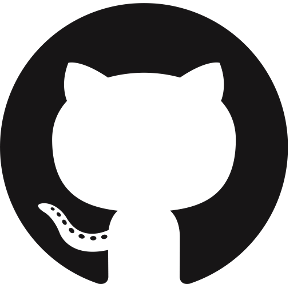

## Hello, I'm Steven (สตีเวน) - aka [StevenJDH][website] 

## I'm a Developer, Traveler, Entrepreneur, and Photographer!!

- 🔭 I just started some interesting projects for the near future!
- 🌱 I’m currently learning more things than I can list here. 🤣
- 👯 I’m looking to collaborate with other developers and content creators.
- 🥅 2023 Goals: Contribute more to Open Source projects.
- ⚡ Fun fact: My best ideas come to me when I'm in the shower. 😊

### Connect With Me:

[][twitter]
[][linkedin]
[][devto]

### Languages and Tools:

---

### 📱 Latest Tweets

<!-- TWITTER:START -->
- [@steventhecoder: Man Discovers Entire Underground City After Knocking Down Basement Wall - ExtremeTech](https://rss.app/articles/cb4e791f6f6d729c074351566bd3a7c508111d6e0c2bb7f7c7ec9312808568c3e70dea4f2d899a2db0bd6b7bdf1c0d9669d76fe7c71b73148f3dc26181)
- [@steventhecoder: First Human Trial of Experimental Cancer-Killing Virus Underway - ExtremeTech](https://rss.app/articles/cb4e791f6f6d729c074351566bd3a7c508111d6e0c2bb7f7c7ec9312808568c3e70dea4f2d899a2db0bd6b78dd1c0b9563d46de7c61a7e108239c26087)
- [@steventhecoder: Dinosaur fossil from asteroid strike that caused extinction found, scien...](https://rss.app/articles/cb4e791f6f6d729c074351566bd3a7c508111d6e0c2bb7f7c7ec9312808568c3e70dea4f2d899a2db0bd6b78dd140b9b61dc6fe6c0137e1c8238c06385)
- [@steventhecoder: Scientists Have Finished Sequencing the Human Genome. Again.](https://rss.app/articles/cb4e791f6f6d729c074351566bd3a7c508111d6e0c2bb7f7c7ec9312808568c3e70dea4f2d899a2db0bd6b78de15079562d360e8c1167e16823bc76780)
- [@steventhecoder: Scientists Have Found a Way to Create Universal Donor Lungs - ExtremeTech](https://rss.app/articles/cb4e791f6f6d729c074351566bd3a7c508111d6e0c2bb7f7c7ec9312808568c3e70dea4f2d899a2db0bd6b79d612099160dd69e2c1107816833bc66b87)
<!-- TWITTER:END -->

➡️ [more tweets...](https://twitter.com/steventhecoder)

---

### 📕 Latest Blog Posts

<!-- BLOG-POST-LIST:START -->
- [Create a Kubernetes NGINX controller with Dapr support](https://dev.to/stevenjdh/create-a-kubernetes-nginx-controller-with-dapr-support-3e8n)
- [Show your Tweets on your GitHub Profile README](https://dev.to/stevenjdh/show-your-tweets-on-your-github-profile-readme-141i)
- [First Post](https://dev.to/stevenjdh/first-post-5c0e)
<!-- BLOG-POST-LIST:END -->

➡️ [more blog posts...](https://dev.to/stevenjdh)

---

  
⚡Recent GitHub Activity

<!--RECENT_ACTIVITY:last_update-->
Last Updated: Sunday 2023/12/03, 1:57:07 AM GMT+0100
<!--RECENT_ACTIVITY:last_update_end-->
<!--RECENT_ACTIVITY:start-->
1. ✌️ Released [1.0.0](https://github.com/StevenJDH/AWS-URL-Shortener/releases/tag/1.0.0) in [StevenJDH/AWS-URL-Shortener](https://github.com/StevenJDH/AWS-URL-Shortener)
2. 📖 Created new wiki page [FAQ](https://github.com/StevenJDH/AWS-URL-Shortener/wiki/FAQ) in [StevenJDH/AWS-URL-Shortener](https://github.com/StevenJDH/AWS-URL-Shortener)
3. 📖 Created new wiki page [Home](https://github.com/StevenJDH/AWS-URL-Shortener/wiki/Home) in [StevenJDH/AWS-URL-Shortener](https://github.com/StevenJDH/AWS-URL-Shortener)
4. 📔 Created new repository [StevenJDH/AWS-URL-Shortener](https://github.com/StevenJDH/AWS-URL-Shortener)
5. 📖 Created new wiki page [Donate-Cryptocurrency](https://github.com/StevenJDH/StevenJDH/wiki/Donate-Cryptocurrency) in [StevenJDH/StevenJDH](https://github.com/StevenJDH/StevenJDH)
<!--RECENT_ACTIVITY:end-->

[website]: https://github.com/StevenJDH "GitHub"
[twitter]: https://twitter.com/steventhecoder "Twitter"
[linkedin]: https://www.linkedin.com/in/stevendeharo "LinkedIn"
[devto]: https://dev.to/stevenjdh "dev.to"
